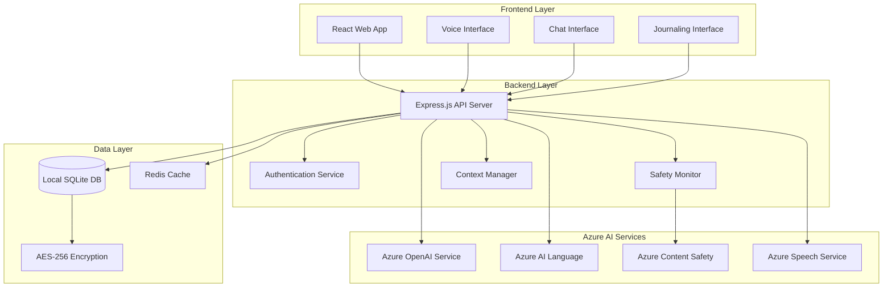

# MindEase Mental Health Chatbot - Design Document

## Overview

MindEase is a full-stack web application that provides empathetic AI-powered mental health support for students. The system integrates multiple Azure AI services to deliver conversational AI, emotional analysis, voice interactions, and safety monitoring while maintaining strict privacy standards. The application follows a modern web architecture with React frontend, Node.js backend, and local encrypted storage.

## Architecture

### System Architecture Diagram



### Technology Stack

**Frontend:**
- React 18 with TypeScript
- Material-UI for consistent design
- Web Speech API integration
- Chart.js for emotional trend visualization
- PWA capabilities for mobile access

**Backend:**
- Node.js with Express.js
- TypeScript for type safety
- Azure SDK for JavaScript
- SQLite with better-sqlite3
- Redis for session management
- Helmet.js for security headers

**Security & Privacy:**
- AES-256 encryption for local data
- JWT tokens for session management
- HTTPS enforcement
- Content Security Policy
- Data anonymization for API calls

## Components and Interfaces

### Frontend Components

#### 1. Chat Interface Component
```typescript
interface ChatInterfaceProps {
  messages: Message[]
  onSendMessage: (content: string, type: 'text' | 'voice') => void
  isLoading: boolean
  voiceEnabled: boolean
}

interface Message {
  id: string
  content: string
  sender: 'user' | 'assistant'
  timestamp: Date
  emotionalTone?: EmotionalAnalysis
  type: 'text' | 'voice'
}
```

#### 2. Voice Interface Component
```typescript
interface VoiceInterfaceProps {
  onVoiceInput: (audioBlob: Blob) => void
  onToggleListening: () => void
  isListening: boolean
  isProcessing: boolean
}
```

#### 3. Journaling Interface Component
```typescript
interface JournalingProps {
  entries: JournalEntry[]
  onCreateEntry: (content: string, type: 'text' | 'voice') => void
  onViewInsights: () => void
}

interface JournalEntry {
  id: string
  content: string
  timestamp: Date
  emotionalAnalysis: EmotionalAnalysis
  themes: string[]
}
```


### Backend API Interfaces

#### 1. Conversation Service
```typescript
interface ConversationService {
  processMessage(userId: string, message: string): Promise<ConversationResponse>
  processVoiceInput(userId: string, audioBlob: Buffer): Promise<ConversationResponse>
  generateResponse(context: ConversationContext): Promise<string>
  analyzeEmotion(text: string): Promise<EmotionalAnalysis>
}

interface ConversationResponse {
  response: string
  emotionalAnalysis: EmotionalAnalysis
  suggestedActions: string[]
  crisisDetected: boolean
  audioResponse?: Buffer
}
```

#### 2. Safety Monitor Service
```typescript
interface SafetyMonitorService {
  checkContent(text: string): Promise<SafetyResult>
  handleCrisisDetection(userId: string, content: string): Promise<CrisisResponse>
  getEmergencyResources(location?: string): EmergencyResource[]
}

interface SafetyResult {
  isSafe: boolean
  riskLevel: 'low' | 'medium' | 'high' | 'crisis'
  categories: string[]
  confidence: number
}
```

#### 3. User Profile Service
```typescript
interface UserProfileService {
  createProfile(userId: string): Promise<UserProfile>
  updateEmotionalSummary(userId: string, analysis: EmotionalAnalysis): Promise<void>
  getPersonalizationData(userId: string): Promise<PersonalizationData>
  resetUserData(userId: string): Promise<void>
}

interface UserProfile {
  userId: string
  preferences: UserPreferences
  emotionalSummaries: EmotionalSummary[]
  copingStrategies: CopingStrategy[]
  lastInteraction: Date
}
```

## Data Models

### Core Data Models

#### 1. User Profile Model
```typescript
interface UserProfile {
  id: string
  createdAt: Date
  preferences: {
    voiceEnabled: boolean
    language: string
    checkInFrequency: 'daily' | 'weekly' | 'custom'
    communicationStyle: 'formal' | 'casual'
    crisisContactInfo?: string
  }
  emotionalBaseline: EmotionalBaseline
  encryptionKey: string
}
```

#### 2. Conversation Context Model
```typescript
interface ConversationContext {
  userId: string
  recentMessages: MessageSummary[]
  emotionalState: EmotionalState
  personalizedPrompts: string[]
  safetyFlags: SafetyFlag[]
  sessionId: string
}

interface MessageSummary {
  timestamp: Date
  emotionalTone: string
  keyThemes: string[]
  userMood: number // 1-5 scale
}
```

#### 3. Emotional Analysis Model
```typescript
interface EmotionalAnalysis {
  sentiment: {
    positive: number
    neutral: number
    negative: number
  }
  emotions: {
    joy: number
    sadness: number
    anger: number
    fear: number
    surprise: number
    disgust: number
  }
  keyPhrases: string[]
  stressIndicators: string[]
  copingMechanisms: string[]
}
```

#### 4. Journal Entry Model
```typescript
interface JournalEntry {
  id: string
  userId: string
  content: string // encrypted
  contentType: 'text' | 'voice'
  timestamp: Date
  emotionalAnalysis: EmotionalAnalysis
  themes: string[]
  mood: number
  copingStrategiesUsed: string[]
}
```

### Database Schema

```sql
-- Users table
CREATE TABLE users (
  id TEXT PRIMARY KEY,
  created_at DATETIME DEFAULT CURRENT_TIMESTAMP,
  preferences TEXT, -- JSON encrypted
  emotional_baseline TEXT, -- JSON encrypted
  encryption_key TEXT,
  last_interaction DATETIME
);

-- Conversations table (summaries only)
CREATE TABLE conversation_summaries (
  id TEXT PRIMARY KEY,
  user_id TEXT REFERENCES users(id),
  session_id TEXT,
  timestamp DATETIME,
  emotional_tone TEXT,
  key_themes TEXT, -- JSON array
  mood_score INTEGER,
  created_at DATETIME DEFAULT CURRENT_TIMESTAMP
);

-- Journal entries table
CREATE TABLE journal_entries (
  id TEXT PRIMARY KEY,
  user_id TEXT REFERENCES users(id),
  encrypted_content TEXT,
  content_type TEXT,
  timestamp DATETIME,
  emotional_analysis TEXT, -- JSON
  themes TEXT, -- JSON array
  mood_score INTEGER,
  created_at DATETIME DEFAULT CURRENT_TIMESTAMP
);

-- Coping strategies table
CREATE TABLE coping_strategies (
  id TEXT PRIMARY KEY,
  user_id TEXT REFERENCES users(id),
  strategy_name TEXT,
  effectiveness_score REAL,
  usage_count INTEGER,
  last_used DATETIME,
  created_at DATETIME DEFAULT CURRENT_TIMESTAMP
);
```

## Error Handling

### Error Categories and Responses

#### 1. Azure Service Errors
```typescript
class AzureServiceError extends Error {
  constructor(
    public service: string,
    public errorCode: string,
    public retryable: boolean,
    message: string
  ) {
    super(message)
  }
}

// Error handling strategy
const handleAzureError = (error: AzureServiceError) => {
  if (error.retryable) {
    return retryWithBackoff(error.service)
  }
  return fallbackResponse(error.service)
}
```

#### 2. Privacy and Safety Errors
```typescript
interface SafetyError {
  type: 'content_violation' | 'privacy_breach' | 'data_corruption'
  severity: 'low' | 'medium' | 'high'
  action: 'log' | 'alert' | 'block'
  message: string
}

const handleSafetyError = (error: SafetyError) => {
  switch (error.action) {
    case 'block':
      return blockUserAction()
    case 'alert':
      return alertAdministrator()
    case 'log':
      return logSecurityEvent()
  }
}
```

#### 3. User Experience Error Handling
- Graceful degradation when Azure services are unavailable
- Offline mode with cached responses for basic interactions
- Clear error messages that maintain empathetic tone
- Automatic retry mechanisms with exponential backoff
- Fallback to text-only mode when voice services fail

## Testing Strategy

### Unit Testing
```typescript
// Example test structure
describe('ConversationService', () => {
  describe('processMessage', () => {
    it('should generate empathetic response for sad input', async () => {
      const result = await conversationService.processMessage(
        'user123',
        'I feel really sad today'
      )
      expect(result.emotionalAnalysis.sentiment.negative).toBeGreaterThan(0.7)
      expect(result.response).toContain('sorry to hear')
    })
    
    it('should detect crisis content and provide resources', async () => {
      const result = await conversationService.processMessage(
        'user123',
        'I want to hurt myself'
      )
      expect(result.crisisDetected).toBe(true)
      expect(result.response).toContain('988')
    })
  })
})
```

### Integration Testing
- Azure service integration tests with mock responses
- End-to-end conversation flows
- Voice input/output pipeline testing
- Database encryption/decryption validation
- Crisis detection and response workflows

### Security Testing
- Penetration testing for data privacy
- Encryption key management validation
- API security and rate limiting
- Content sanitization verification
- Privacy compliance auditing

### Performance Testing
- Response time benchmarks (< 3 seconds for text, < 5 seconds for voice)
- Concurrent user load testing
- Azure service rate limit handling
- Database query optimization
- Memory usage monitoring for local storage

### Accessibility Testing
- Screen reader compatibility
- Keyboard navigation support
- Voice interface accessibility
- Color contrast and visual design
- Mobile responsiveness testing

## Deployment Architecture

### Hosting Infrastructure (Azure-Only Stack)

**Azure Static Web Apps:**
- Hosts both React frontend and Node.js backend
- Integrated CI/CD with GitHub
- Automatic HTTPS and custom domains
- Built-in authentication
- **Cost:** Free tier (perfect for MVP with $50 credits)

**Database:**
- **Local SQLite** files on Azure Static Web Apps backend
- **Azure Storage Account** for encrypted database backups (LRS)
- No external database service needed (privacy by design)
- **Cost:** ~$1/month for storage (General Purpose v2, LRS)

**Additional Services:**
- **Azure Key Vault** (Basic tier): ~$1/month for API key management
- **Azure Application Insights** (included in free tier): $0/month for basic monitoring

### MVP Infrastructure Cost: ~$2/month (well within $50 credits)

### Cost Per User Analysis (50 users with $50 budget):
- **Azure AI Services:** $2.36 × 50 = $118/month
- **Infrastructure:** $2/month  
- **Total:** $120/month for 50 users = **$2.40 per user/month**

**With $50 Azure credits, you can support ~20 active users for a full month**

### Development Environment
- Local SQLite database
- Azure service development keys
- Hot reload for frontend and backend
- Mock Azure services for offline development

### Production Environment
- HTTPS-only deployment
- Environment variable management
- Automated backup systems
- Monitoring and alerting
- Compliance logging for healthcare regulations
- Multi-region deployment for international students

### Security Considerations
- Zero-trust architecture
- Principle of least privilege for Azure service access
- Regular security audits
- Incident response procedures
- Data breach notification protocols